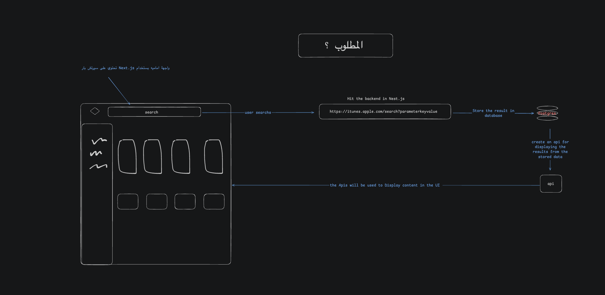
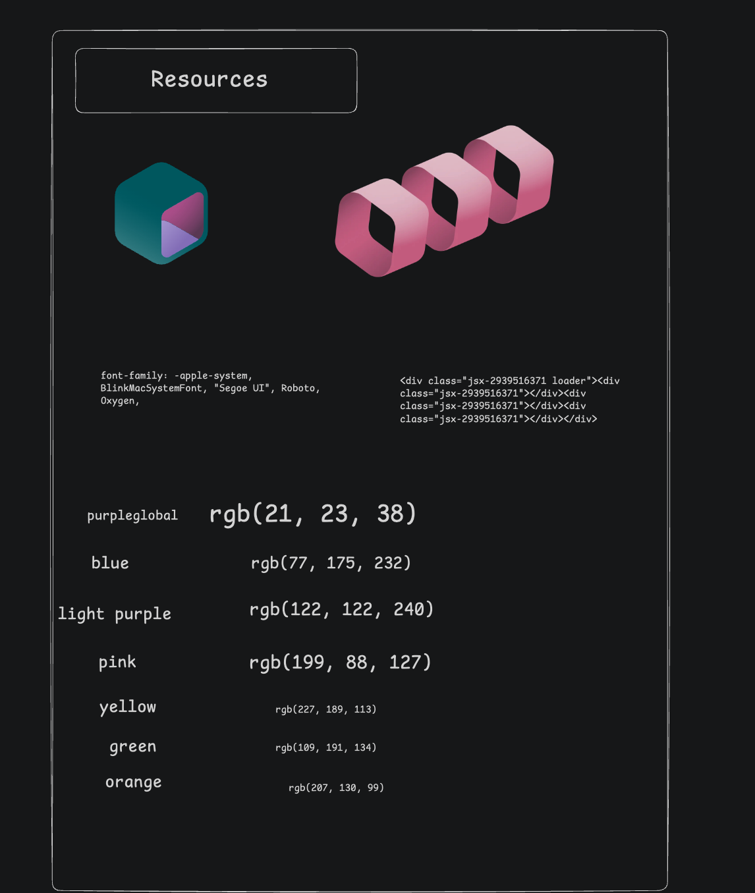
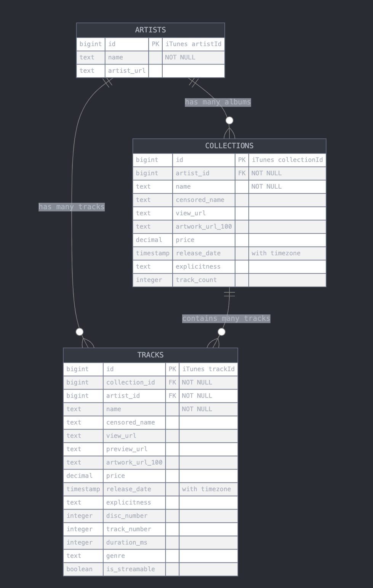

# Project Documentation

## Solution Approach
1. Started by thoroughly testing and analyzing the API architecture to understand its capabilities and limitations
2. Created a detailed layout and architecture plan for the solution

3. Set up the frontend and backend architecture and initialized a GitHub repository for version control
4. Conducted UI research and analysis since no design system was provided
   - Used Chrome extensions to extract exact colors and icons from reference sites
   - Documented all UI resources and components

5. Implemented the initial UI components and layout
6. Designed the database schema and relationships

7. Successfully implemented the database tables using Drizzle ORM
8. Built out the backend API:
   - Created service layers for business logic
   - Implemented controllers for routing and request handling
   - Added proper error handling and validation
9. Connected the frontend to the backend API:
   - Implemented API integration
   - Added error handling and loading states
   - Ensured type safety between frontend and backend

## Architecture

### Frontend
- Built with Next.js 15.3.2
- React 19
- TypeScript
- TailwindCSS for styling
- Modern development tools including ESLint and Prettier

### Backend
- NestJS framework
- TypeScript
- PostgreSQL database with Drizzle ORM
- Comprehensive testing setup with Jest
- Environment configuration management

## Technologies Used

### Frontend Technologies
- Next.js 15.3.2
- React 19
- TypeScript
- TailwindCSS 4
- ESLint 9
- Prettier
- Tailwind Scrollbar

### Backend Technologies
- NestJS 11
- TypeScript
- PostgreSQL
- Drizzle ORM
- Jest for testing
- Class Validator
- Class Transformer
- RxJS

## Development Challenges 

1. Learning Curve with New Technologies
   - Adapting to Next.js 13+ app router from pages router
   - Learning Drizzle ORM's type-safe query building
   - Understanding NestJS dependency injection and decorators

2. Frontend Implementation Challenges
   - Implementing UI design requirements from the provided mockup
   - Creating responsive grid layouts with Tailwind CSS for different screen sizes
   - Building reusable components like track 

3. Backend Architecture Decisions
   - Choosing between different ORMs (Prisma vs Drizzle)
   - Structuring the application for scalability
   - Implementing proper error handling patterns
   - Setting up efficient database schemas

4. Integration Challenges
   - Ensuring type safety between frontend and backend
   - Managing CORS and security configurations
   - Handling API rate limiting and optimization
   - Implementing proper error handling across the stack


## Project Structure

```
├── frontend/
│   ├── app/
│   ├── components/
│   ├── public/
│   └── [configuration files]
└── backend/
    ├── src/
    ├── test/
    ├── drizzle/
    └── [configuration files]
```

## Development Workflow

1. Frontend Development
   - Development server runs on port 3001
   - Uses Turbopack for faster development experience
   - Implements modern React patterns and hooks

2. Backend Development
   - NestJS server with TypeScript
   - Database migrations managed through Drizzle
   - Comprehensive testing setup

## Future Improvements

1. Frontend
   - Implement more comprehensive error handling
   - Add more unit tests
   - Optimize performance

2. Backend
   - Add more API endpoints
   - Implement caching
   - Enhance security measures

## Conclusion
This project demonstrates a modern full-stack application using cutting-edge technologies. The challenges faced during development have led to valuable learning experiences and improved code quality. The separation of concerns between frontend and backend, along with the use of TypeScript throughout the stack, has resulted in a maintainable and scalable application. 